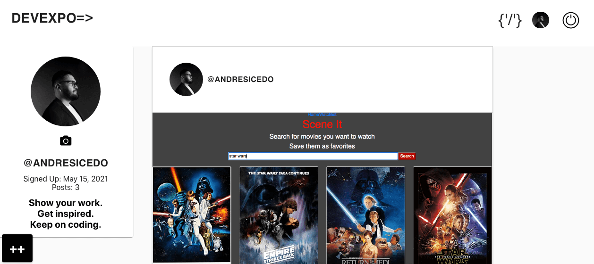

# 
 DevExpo 

 
 

## About this project 📝

DevExpo is a social media application that allows developers and creators to 
display their projects to the developer community. Users can create a post 
about their project and let the community know what technology stack they're 
using, post an image that best reflects the functionality of the project and 
provide a link for the community to go and experience your project for 
themselves. Users also have the ability to comment on project posts. This is
a great opportunity to engage with users who are interested in your work.
Building a space for developers and designers to display their work is the 
main focus of the application. Future updates to the project could include: 
the ability to follow other users, liking user posts, user bio on profile page; 
to name a few.
 
 
 
 

## Timeline 💻

## Technologies 💻

 

 
 
 

## Authors

* [Andres Icedo](https://github.com/andresicedo)

 
 

## License

* [MIT](https://opensource.org/licenses/MIT)